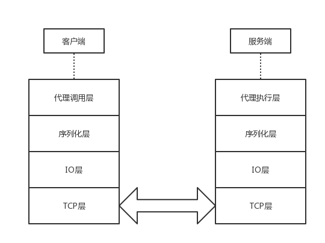

# MyRPC4RS

> PingCAP 校招小作业

## 题目

使用 future/tokio-core，设计实现一个路径规划 RPC 服务。要求

1. 可以进行最优路径规划；
2. 便于使用的 API；
3. 路径规划需要考虑路径的繁忙程度；
4. 提供异步 API 库；
5. 要有实际运行的例子。

> 题目对我来说有点难理解，暂且理解为：实现一个RPC框架，且使用此RPC框架实现一个路径规划算法，封装为服务对外。

## 工作计划

- [x] 09.09 立项，设计总体架构，熟悉tokio及futrue框架   
- [x] 09.10 完成rpc远程调用  
- [ ] 09.11 设计rpc框架用户接口  
- [ ] 09.12 实现路径规划算法  
- [ ] 09.13 冗余时间  
- [ ] 09.14 冗余时间  

## 架构

* TCP层即为系统TCP传输层，受系统管理，应用通过socket api与其交互
* NET层负责与TCP层交互，接受、发送数据
* 序列化层负责对二进制数据的序列化与反序列化，可以支持多种序列化格式
* 代理层负责代理用户发起的调用，代理其通过RPC执行远程过程

其中NET层使用单独的一个线程维护，其他层运行在使用一个或多个线程中，线程间使用消息机制通讯。

## 协议

### NET层协议

| 0-7B | 8-nB |
| ----- | --- |
| 包长度 | 数据 |

## 遇到的问题

### 1. 构造通用类型

在RPC框架的应用场景中，我们不知道用户函数的参数或返回值类型，因此需要构造一个通用的类型来存储用户的函数参数即返回值。
在Java语言中，使用Object基类就可以表示所有类型，但Rust对类型有严格限制，不能通过公共基类的方式实现此功能。
为此我参考了json_rpc的实现，基本思路是使用枚举对基本类型、Array、Map进行封装，但实现过程中发现一些问题，例如对数值类型的封装
如果对u8,u16,i8,f8等类型都进行封装一是代码冗长不优雅，二是难以拥抱变化。

解决方案：用户函数参数类型我们在框架开发的过程不能确定，但并不是运行期才知道，用户编译期就可以确定，因此考虑采用宏和序列化工具来解决这个问题。

### 2. 生命周期了解不够深入

因为在学习rust之前，我写java比较多，受java语言对面向对象实现的方式所影响，对系统进行抽象时遵循着java的思路，但实际开发过程中，经常会被生命周期的限制卡住脖子（尤其是使用trait实现多态时），
有的地方通过查询资料和文档得以解决，有的地方便不得已退而求其次，这使得部分模块进行了不必要的耦合，该进行复用的代码也没有实现优雅的复用。

解决方案：待我对rust掌握更熟练后，有必要将此项目重构一下。另外有时候可以依赖宏来解决问题。对于java而言，因为他本身不支持宏，所以绝大多数开发期间确定不了的问题使用继承、多态来解决的，
但对于rust来说，宏系统非常强大，并不是所有未知问题都是只能在运行期才确定，这就是宏的用武之地，这在我之前的开发经验中不曾了解的。